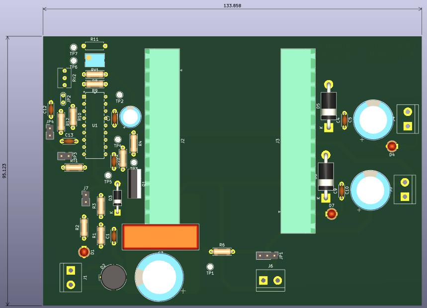
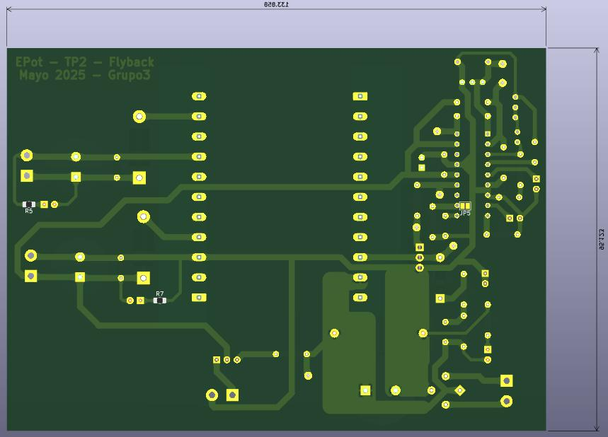
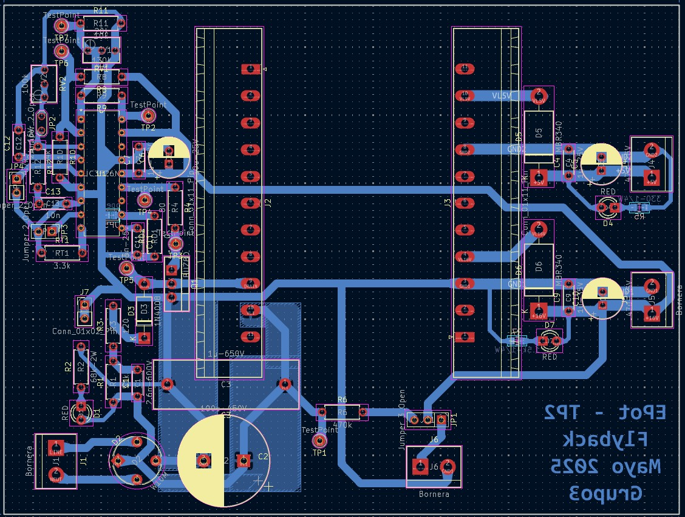
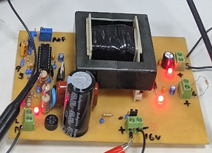

# TP2: Flyback Converter

## Description
This assignment covers the design, simulation, and PCB layout of a **Flyback** DC-DC converter topology.

## Project Structure
- `sim/`: Circuit simulations.
- `pcb/`: Printed Circuit Board design.
- `Datasheets/`: Data sheets for critical components.
- `assignment/`: Assignment requirements.
- `plots/`: Plots of obtained results.
- `entrega/`: Final documentation presented.

## Hardware and PCB
Representative images of the PCB design and the final hardware:

> *3D Render - Front*:

> *3D Render - Back*:

> *PCB Routing*:

> *Assembled Flyback Converter*:

## Authors
- G3: Cílfone, Di Sanzo, Figueroa, Gioia, Heir
