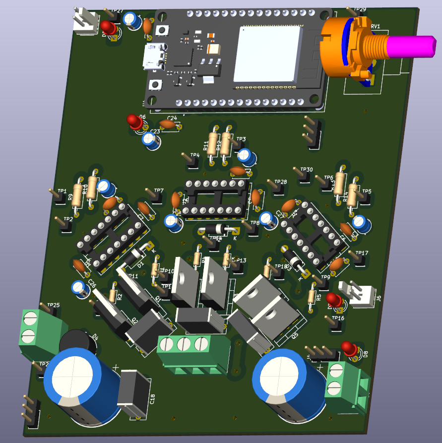
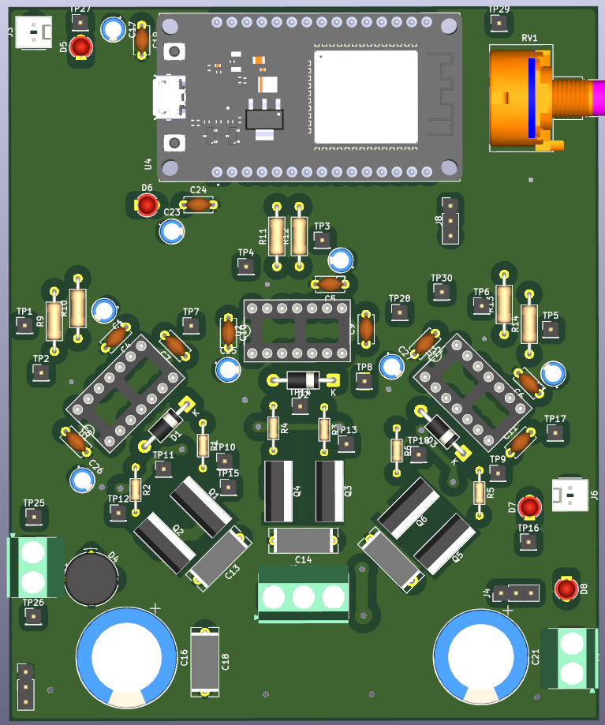
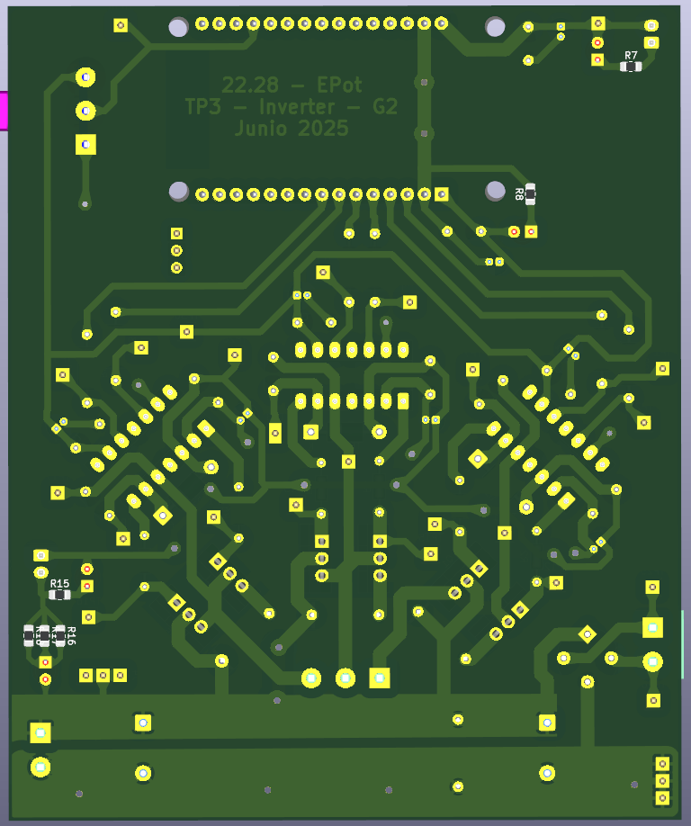

# TP3: Inverter (DC-AC Inverter)

## Description
This assignment consists of implementing a **DC-AC Inverter** using the **SPWM** (Sinusoidal PWM) modulation technique. Signal generation is performed using an **ESP32** microcontroller.

## Features
- **SPWM Generation**: Implemented in firmware for the ESP32.
- **Frequency Control**:
    - **ADC Mode**: Controlled via potentiometer (Pin 34).
    - **Serial Mode**: Commands via terminal to set a specific frequency.
- **Frequency Range**: 15 Hz to 99 Hz.

## Project Structure
- `fw/`: Firmware source code (PlatformIO).
- `pcb/`: Power and control board design.
- `sim/`: Simulations of the power stage and filters.
- `measurements/`: Experimental measurements.
- `assignment/`: Assignment requirements.

## Serial Commands (in `fw`)
- `help`: Shows the command list.
- `mode adc`: Switches to potentiometer control mode.
- `mode serial`: Switches to command control mode.
- `freq <value>`: Sets the frequency (only in serial mode).
- `start`/`stop`: Starts or stops PWM generation.

## PCB Renders
3D Renders of the Inverter control and power board:

> *3D Render - Perspective*:

> *3D Render - Top View*:

> *3D Render - Bottom View*:

## Authors
- G3: Cílfone, Di Sanzo, Figueroa, Gioia, Heir
